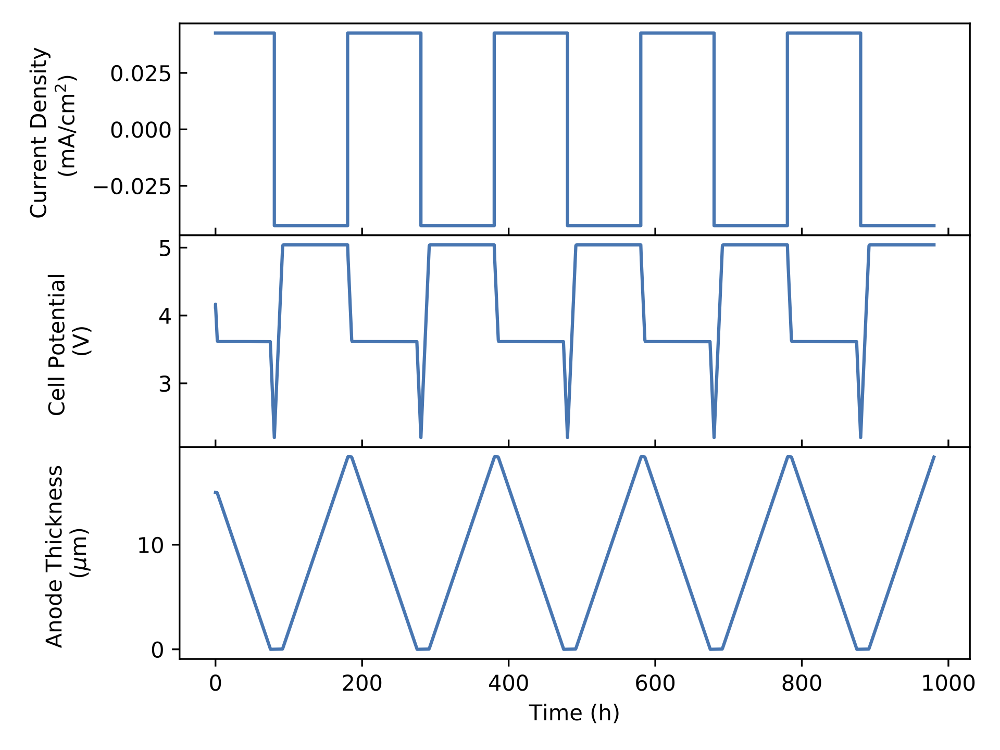

# BatCan
Battery--Cantera: Modeling fundamental physical chemistry in batteries using Cantera. 

This tool allows you to run battery simulations with eaily editable and extensible thermochemistry via [Cantera](cantera.org).

# Repository contents
- `bat_can.py`: this is the main file that runs the code.  In general, the code is run on the command line via `python bat_can.py` (more on this [below](#Running-the-model))
- `bat_can_init.py`: reads user inputs and initializes the model.  It is called internally by `bat_can.py`.
- Simluation packages which define different simulation types/routines:
    1. `CC_cycle.py`: constant current galvanostatc cycling.
- Electrode model packages:
    1. `single_particle_electrode`: the standard "single particle model" approach to a porous electrode.
    2. `dense_electrode`: Model for a dense, thin-film electrode.  Currently demonstrated for a lithium metal anode, but could be used for other purposes.

- Electrolyte model packages:
    1. `ionic_resistor`: Simple ionic resistor with no chemical composition dynamics.
    2. `porous_separator`: porous inert separator filled with electrolyte.
- `inputs`: folder with all input files.
- `old_model_files`: Files associated with previously-developed models, which are currently being integrated into the new model framework. 
# Installation Instructions

In order to use the BatCan suite, it is necessary to download and install:
- [Cantera](cantera.org)
- [Numpy](numpy.org)
- [Scikits.odes](https://pypi.org/project/scikits.odes)
- [Ruamel.yaml](https://pypi.org/project/ruamel.yaml/)
- [Matplotlib](matplotlib.org)

These can all be installed an managed via [Anaconda](anaconda.org)

For example, to create a conda environment `bat_can` from which to run this tool, enter the following on a command line, terminal, or Anaconda prompt:
```
conda create --name bat_can --channel conda-forge cantera scikits.odes matplotlib numpy ruamel.yaml 
```
You can replace `bat_can` with whatever other name you would like to give this environment. After this completes, activate the environment:
```
conda activate bat_can
```
(again, replacing `bat_can`, as necessary, if you've named the environment something different). When you're done using the tool and want to switch back to your base software environment, run:
```
conda deactivate
```

# Running the Model 
To run the model, there are two main steps:
1. [Choose or develop an input file](#Input)
2. [Run the model](#Run-the-Model)

## Input 
The input file provides all the necessary information to `bat_can` program so that it may run your simulation.

The input file includes three primary sections:
- A description of the battery components (anode, electrolyte separator, and cathode), including model type for each, geometry and microstructural parameters.
- A description of the simulation to run and parameters to specify the necessary operating conditions.
- A Cantera input section, used to create objects that represent the phases of matter present, the interfaces between then, and the thermodynamic, chemical kinetic, and transport processes involved.

If you would like to create your own input, there is an `input_template.yaml` that you can save a copy of and edit. 

All input files are located in the `inputs` folder.  Locate one that you would like to use, modify an existing file to suit your purposes, or copy a file, save it to a new name, and edit as necessary.

At present, the input file must be saved to the `inputs` folder.

## Run the Model
The model is run from a command line or terminal by invoking python, the `bat_can.py` name, and providing the name of your input file (wihout the `.yaml` suffix) by assigning the keyword `--input`. For example, if your input file is located at `inputs/my_input.yaml`, you would run:
```
python bat_can.py --input=my_input
```

## Current status of the software (as of 04 May, 2021)
This software is currently in the development phase.  The `ionic_resistor` separator model is complete, but all other component models are in development (primarily, governing equations are being added to describe the evolution of the local chemical compositiondifferent electrode and electrolyte.  Therefore, we would currently describe the software capabilities as ''for demonstration purposes only."

If you would like to help contribute to the software, please do! If you are uncertain of what to do, or have an idea and want to run it by us, maybe create an issue on the issues page, where we can discuss.  Or else, feel free to fork a copy of this repo, make changes, and make a pull request.

## Sample results.
Below is an example of the model output, for a Li metal anode, porous separator with liquid carbonate electrolyte, and single-particle model of an LCO cathode, cycled 5 times at a rate of 0.01C (Note: these parameters have not been tuned. Again--for demonstration purposes only :) ).


